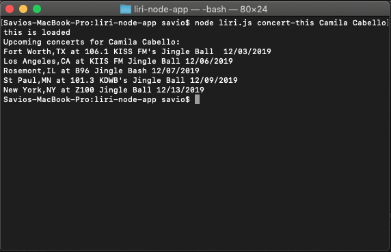
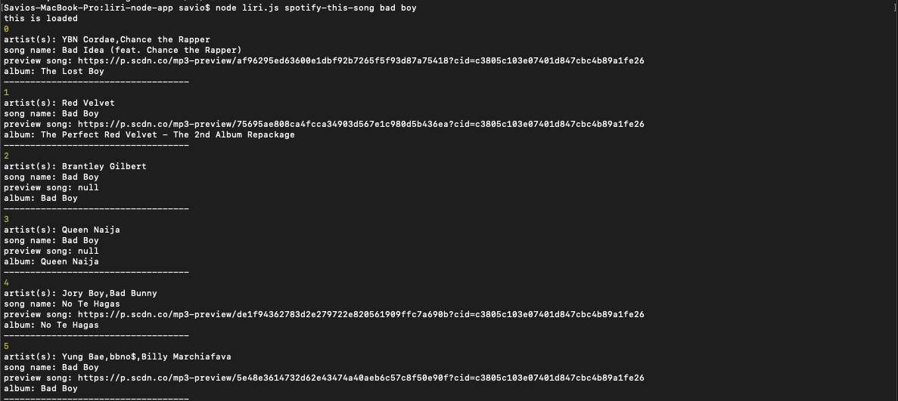
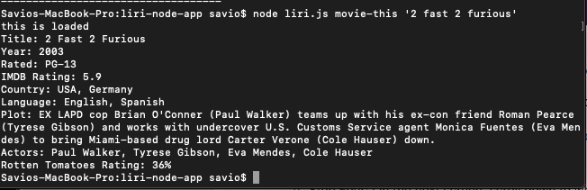
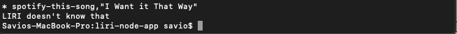

# Liri Bot App
Hello all,

For this homework, I was able to create a node bot that will allow us to get info about movies,music and even music artists when they are searched. This homework had me test my skills with axios, js and more.

## API 
The APIs that were used were, Spotify (music), OMDB (movies), and the site bandsintown.com. Obtaining the Spotify key was the hardest to obtain but nothing that couldn't be done within 10 minutes.
- Spotify
   - With the Spotify API, it allowed me to grab information about songs that were searched. It also gives me information about which artists performed it, which albums it is on and even gives you a link for a preview of the song.
 
- Bands in Town
   - bandsintown.com allowed me to see where the searched band/artist will be playing. This will help me prepare to go to certain concerts. Not only does this give you the date of the concert, it will tell you the actual venue of the concert.
 
- OMDB
   - This API gives you info about the searched movie. When you search for a movie, liribot will give you the Title, year that is was released, the rating of the movie, the plot and even rating from IMDB and Rotten Tomatoes.

## Examples/Screenshots

## End
Thank you for checking this out. It was definitely challenging but it was a great learning experience. I believe I'll be able to use this in the future.